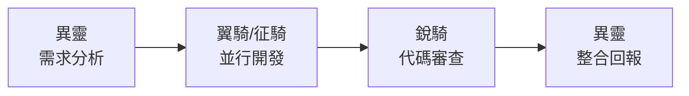

# 3C團隊結構與協作流程

## 決策背景

**決策日期**：2026-10-07  
**決策者**：setusyoi (專案負責人)  
**影響範圍**：鬥氣割草專案開發團隊

## 團隊配置

### 角色定義

**異靈** (協調者)
- **職責**：專案協調、需求分析、任務分派、品質把關
- **技能**：遊戲設計、彩票系統、系統性問題解決
- **工作重點**：團隊協調、除錯診斷、規範執行

**翼騎** (主開發)  
- **職責**：核心功能開發、技術架構設計
- **配置**：Claude-Code + Opus 5.5 (升級版本)
- **工作重點**：主要程式開發、技術難點攻克

**征騎** (副開發)
- **職責**：功能實作、系統優化、輔助開發  
- **工作重點**：並行開發、功能擴展、效能優化

**銳騎** (代碼審查)
- **職責**：代碼品質檢查、規範執行、安全審查
- **工作重點**：Code Review、標準執行、品質把關

## 協作流程

### 4段式開發流程

**階段說明**：
1. **需求分析** - 異靈接收需求，分析拆解，分派任務
2. **並行開發** - 翼騎、征騎根據分工同時進行開發
3. **代碼審查** - 銳騎檢查代碼品質，確保符合規範  
4. **整合回報** - 異靈整合成果，向用戶報告

### 溝通規範

1. **任務導向**：明確的任務描述和交付標準
2. **並行協作**：翼騎、征騎可同時處理不同功能
3. **品質把關**：銳騎審查所有提交的代碼
4. **統一回報**：異靈統一整合和回報進度
5. **破壞性操作確認**：執行可能影響系統穩定性的操作前必須經使用者確認

## 工具和規範

### 開發規範
- **程式碼標準**：h5-coding-standards SKILL
- **評分機制**：JSDoc(25%) + 魔法數字(20%) + 命名(15%) + 結構(15%) + 註解(15%) + TypeScript(10%)

### 協作工具
- **版本控制**：Git (deploy-refactor分支)
- **溝通平台**：AgEnD Fleet系統
- **文檔管理**：WIKI系統 (本文檔所在)

## 決策原因

**升級理由**：
- 提升開發效率和代碼品質
- 建立明確的責任分工
- 確保代碼審查流程
- 標準化協作方式

**預期效果**：
- 代碼品質一致性提升
- 開發流程更加順暢
- 團隊協作更有序
- 知識傳承更完整

---
*決策ID：a2955dec-ac50-4b3a-b124-c83db706f9b0*  
*創建日期：2026-10-07*  
*維護者：異靈*
